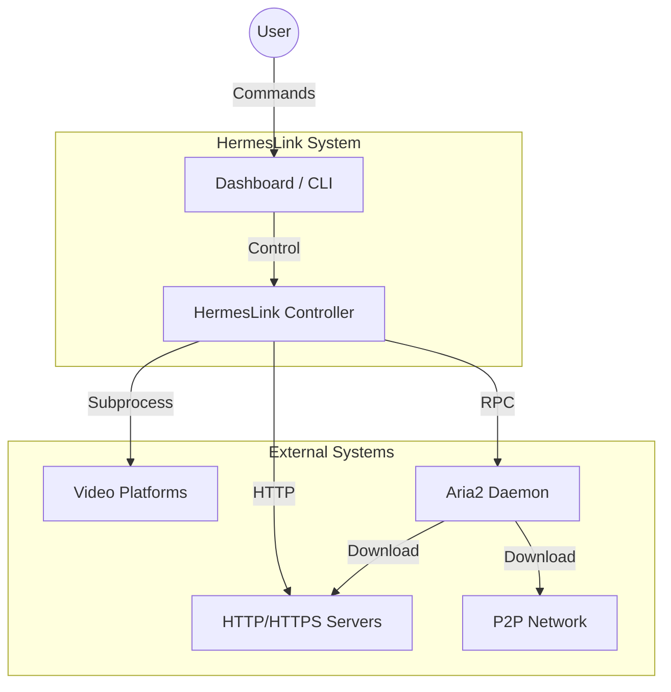
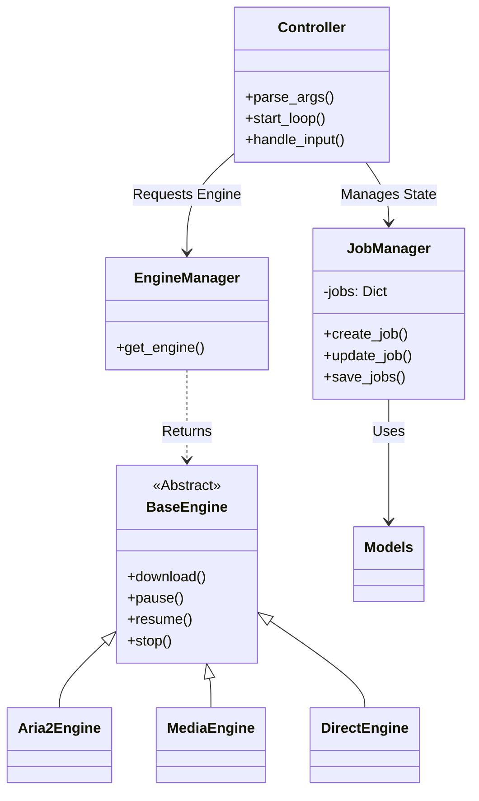
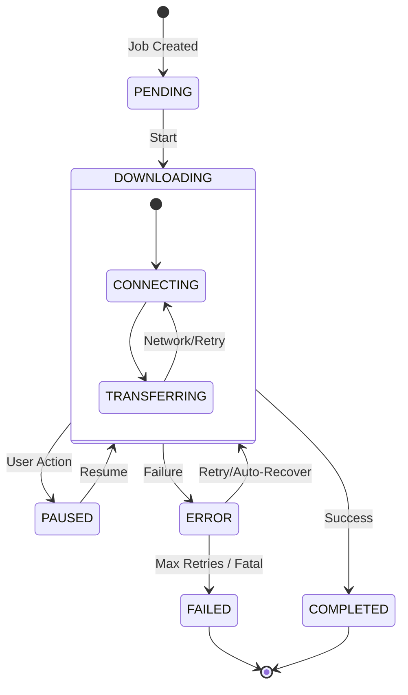
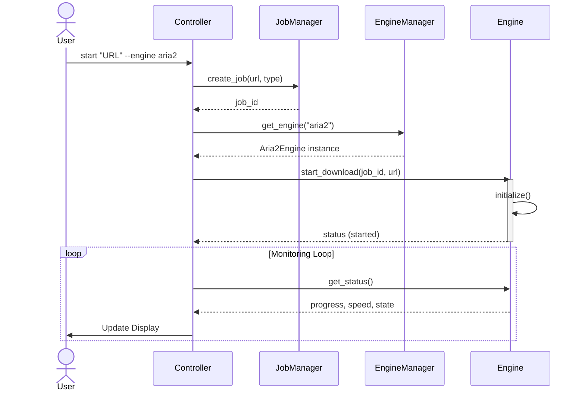

# HermesLink Architecture

This document provides a visual overview of the HermesLink system architecture, including system context, component interactions, and state management.

## 1. System Context

High-level view of how HermesLink interacts with the user and external systems.

## 2. Component Architecture

breakdown of the internal components and their relationships.

## 3. Job Lifecycle

The state transitions of a generic download job within HermesLink.

## 4. Download Sequence

The sequence of operations when a user initiates a download.

