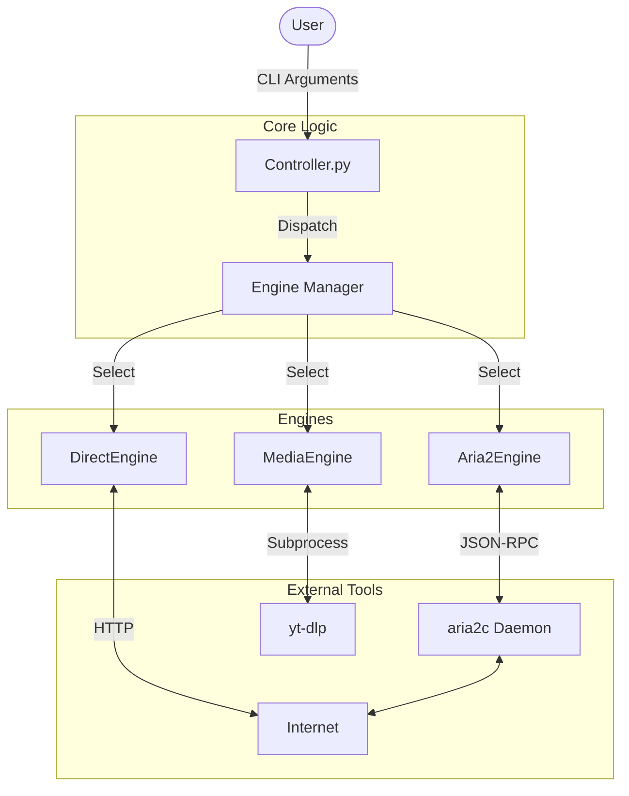
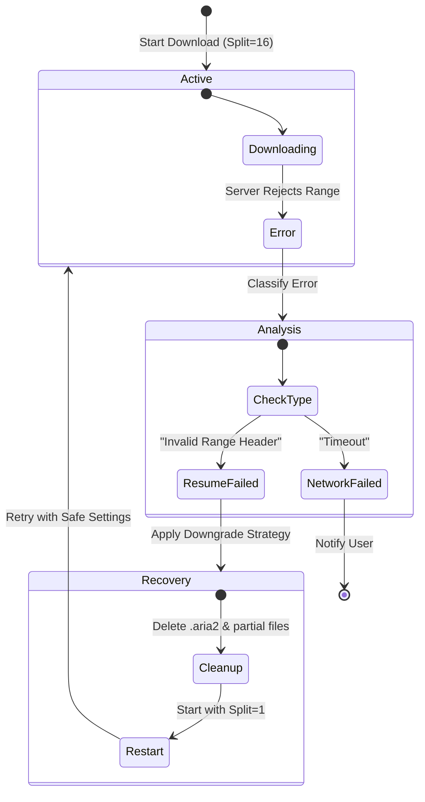

# ⚡ HermesLink

> **Next-Generation Download Orchestrator**
> _Intelligent, Error-Aware, and Multi-Protocol_

HermesLink is a modular python-based download controller designed to unify various download protocols (HTTP, FTP, BitTorrent, Video/Audio) under a single, robust interface. It leverages powerful backend engines like **Aria2** and **yt-dlp** to provide a seamless and resilient download experience.

---

## 🌟 Key Features

### 🧠 Smart Control

- **Interactive CLI**: Real-time control loop allowing you to **Pause**, **Resume**, and **Stop** downloads instantly.
- **Daemon Management**: Automatically detects, starts, and manages background daemons (like `aria2c`).
- **Live Monitoring**: Real-time feedback on speed, progress percentage, and status.

### 🛡️ Error-Aware Architecture

Move beyond "fire and forget." HermesLink understands _why_ a download failed and acts accordingly.

- **Auto-Classification**: Distinguishes between network timeouts, server rejections, and resume failures.
- **Downgrade Strategy**: Automatically downgrades multi-threaded optimization to safe single-thread mode if servers reject connections.
- **Self-Healing**: Capable of detecting corrupted partial files, performing cleanup, and restarting downloads automatically.

### 🔌 Multi-Engine Support

- **Aria2 Engine**: For high-speed HTTP/FTP/Torrent downloads with multi-connection support.
- **Media Engine**: (Powered by `yt-dlp`) For extracting video and audio from 1000+ sites.
- **Direct Engine**: Lightweight HTTP downloads via Python `requests`.

---

## 🏗️ Architecture

HermesLink follows a controller-engine pattern, abstracting complexity away from the user.

### System Overview



### Self-Healing Workflow (Aria2)

A visual representation of how HermesLink handles complex errors like "Invalid Range Headers" (Resume Not Supported).



---

## 🚀 Getting Started

### Prerequisites

- **Python 3.8+**
- **Aria2**: Ensure `aria2c` is installed and in your system PATH.
- **yt-dlp**: Required for media downloads.
  ```bash
  pip install yt-dlp requests
  ```

### Installation

1. Clone the repository:
   ```bash
   git clone https://github.com/PrithvirajSinghChauhan8444/HermesLink.git
   ```
2. Navigate to the project root:
   ```bash
   cd HermesLink
   ```

---

## 📖 Usage

Run the controller via the command line.

### Basic Download

```powershell
python src/controller.py "https://example.com/file.zip" --type aria2
```

### Interactive Controls

Once the download starts, you can control it directly from the terminal console:

|  Key  | Action     | Description                                  |
| :---: | :--------- | :------------------------------------------- |
| **P** | **Pause**  | Temporarily halt the download.               |
| **R** | **Resume** | Continue downloading from where it left off. |
| **S** | **Stop**   | Cancel the download and remove the job.      |
| **Q** | **Quit**   | Stop and exit the program.                   |

### Handling Errors

If a download encounters a critical error (like a server refusing to resume), HermesLink will:

1. Attempt to auto-recover.
2. If auto-recovery fails, it will ask you:
   > "Do you want to wipe files and restart the download completely? (y/n)"

---

## 📂 Project Structure

```
HermesLink/
├── src/
│   ├── controller.py       # Main Application Entry Point
│   ├── core/               # Business Logic
│   └── engines/            # Engine Implementations
│       ├── base.py         # Abstract Base Class
│       ├── aria2.py        # Aria2 Wrapper (JSON-RPC)
│       ├── media.py        # yt-dlp Wrapper
│       └── direct.py       # Direct HTTP Wrapper
├── config.yaml             # Configuration Settings
└── README.md               # Documentation
```

---

## 🤝 Contributing

Contributions are welcome! Please submit a Pull Request or open an Issue for discuss new features.

---

