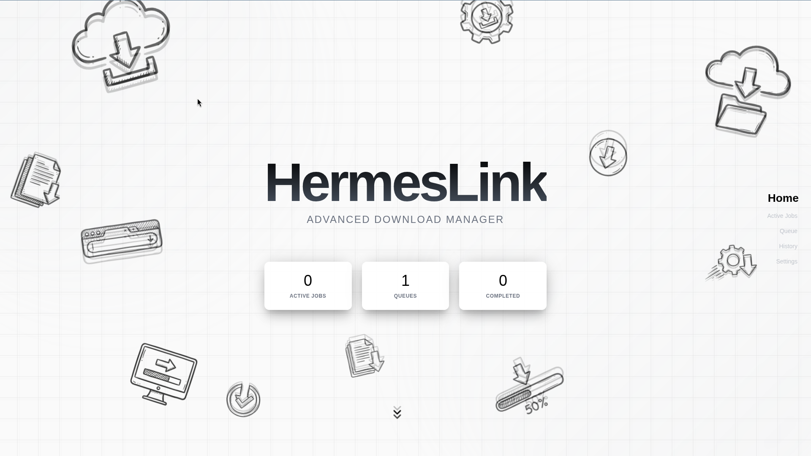
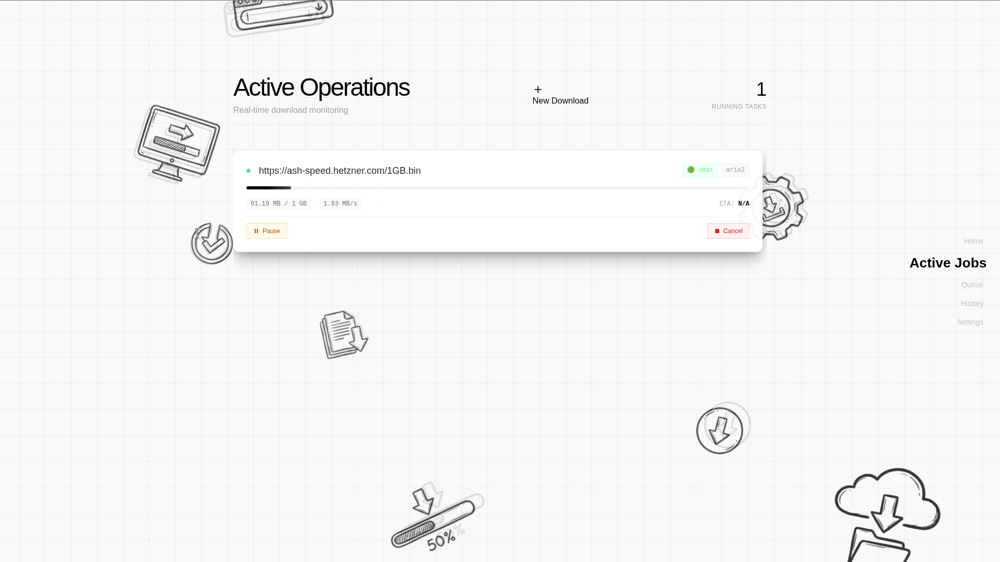
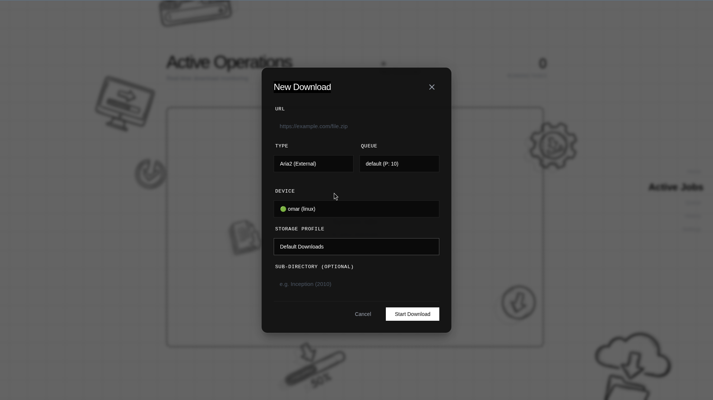
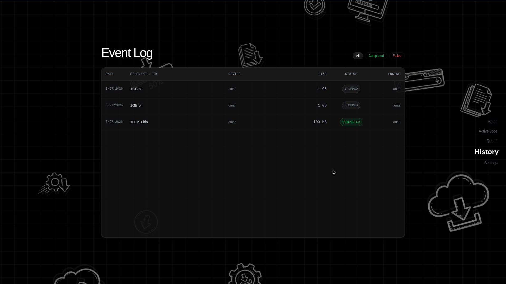

<p align="center">
  
</p>

<h1 align="center">HermesLink</h1>
<p align="center">
  <em>A distributed, real-time remote download manager.</em>
  <br/>
  Submit downloads from anywhere. Execute them on any device.
</p>

<p align="center">
  
  
  
  
  
</p>

---

## 🤔 What is HermesLink?

HermesLink separates the **intent** (what to download) from the **execution** (where to download it). You submit a download from a web browser on your phone, and it executes on your home server, office PC, or any device running the HermesLink agent.

```
You (phone/laptop)  →  Web Dashboard  →  Firebase  →  Agent on your PC  →  File downloaded
```

### Who is this for?

- You want to start a download on your home PC while at work
- You manage downloads across multiple machines
- You want a centralized dashboard for all your downloads

---

## 📊 Current State

> Based on actual codebase inspection — not aspirational.

### ✅ Device System (Presence & Discovery)

- Agent (`test_agent.py`) registers in Firebase RTDB under `presence/{device_id}` on boot with a custom `device_name` (or fallback hostname), platform, status, and storage profiles
- Continuous heartbeat updates `last_seen` every 30 seconds
- Frontend `useDevices.js` hook subscribes to RTDB presence for real-time device listing
- Graceful shutdown sets status to `"offline"`

### ✅ Job System (Full Lifecycle)

- Jobs are created in **Firestore** from the web dashboard with `state: PENDING` and a target `device_id`
- Agent detects new jobs via **Firestore `on_snapshot`** — zero-polling, event-driven dispatch
- `FirebaseJobBridge` writes live progress to **RTDB** (avoids Firestore write quotas) and syncs terminal states (`COMPLETED`, `FAILED`, `STOPPED`) back to **Firestore** for persistence
- Frontend hooks: `useJobs.js` (Firestore job list), `useJobProgress.js` (RTDB live progress)

### ✅ Download Controls (Real-Time)

- **Pause / Resume / Stop** via RTDB `action` nodes — agent listens and forwards commands to the active engine
- Sub-second control latency
- Frontend `ActiveJobsSection.jsx` renders control buttons

### ✅ Download Engines

| Engine                   | File          | Status               | Details                                                                                                                                                                                          |
| ------------------------ | ------------- | -------------------- | ------------------------------------------------------------------------------------------------------------------------------------------------------------------------------------------------ |
| **Aria2**          | `aria2.py`  | ✅ Fully implemented | JSON-RPC control, daemon management, multi-thread download, pause/resume/stop, error classification, automatic downgrade to single-thread on resume failure, partial file cleanup, force restart |
| **Media (yt-dlp)** | `media.py`  | ✅ Fully implemented | Native YouTube integration, dynamic API metadata fetching, format selection (Audio-Only / Audio+Video), and robust process signaling for pause/resume.                                           |
| **Direct HTTP**    | `direct.py` | 🟡 Incomplete        | Basic scaffold with streaming download logic, not wired into agent                                                                                                                               |
| **P2P (Torrent)**  | `p2p.py`    | ❌ Empty scaffold    | File exists but contains no code                                                                                                                                                                 |

> **Note:** **Aria2** and **yt-dlp** engines are currently active and integrated. Other engines are early scaffolds.

### ✅ Storage Profiles (Multi-Destination)

- `config.yaml` defines named profiles with multiple `paths` per profile
- Tracks per-profile `subfolders` history natively: custom sub-directories are persisted automatically for future selections
- Agent expands `~`, derives human-friendly `base_names` from folder names, publishes to RTDB
- Frontend `NewJobModal.jsx` shows Storage Profile + Destination + Subfolder History dropdowns
- Path traversal protection via `os.path.abspath` + `startswith` validation
- Backward compatible — auto-migrates old singular `path` key to `paths` list

### ✅ Queue Management (Firebase-Only)

- Queue configs stored in **Firestore `queues/` collection** — single source of truth
- `useQueues.js` hook provides real-time subscription + create/update/delete
- `QueueSection.jsx` renders queue cards with create/edit/delete modals, toggle active/paused
- Agent reads queue config (`max_threads_per_job`, `max_parallel_jobs`) from Firestore per job
- Default queue cannot be deleted

### ✅ API Server

- FastAPI server (`api_server.py`) with Firebase Auth token verification on all endpoints
- Endpoints: job CRUD, job actions (pause/resume/stop), job history
- CORS configured for frontend dev server

### ❌ Not Yet Implemented

- **Agent packaging** — runs as raw Python, no executables or installers
- **Multi-user support** — single-user by design
- **Zombie job recovery** — no sweeper for jobs stuck in `RUNNING` when agent crashes
- **Notification system** — no Telegram/Discord/push alerts

### Architecture Highlights

| Feature                               | How                                                 |
| ------------------------------------- | --------------------------------------------------- |
| Zero-idle-cost job dispatch           | Firestore `on_snapshot` (no polling)              |
| Sub-second download controls          | RTDB action nodes                                   |
| Progress without Firestore quota burn | Progress → RTDB only; terminal states → Firestore |
| Pluggable download engines            | Strategy pattern with `BaseEngine` interface      |
| Path traversal protection             | `os.path.abspath` + `startswith` validation     |

---

## 🖼️ Screenshots

<p align="center">
  
</p>
<p align="center"><em>Active downloads with real-time progress tracking</em></p>

<p align="center">
  
</p>
<p align="center"><em>New download modal — select device, storage profile, and queue</em></p>

<p align="center">
  
</p>
<p align="center"><em>Download history with completed and failed jobs</em></p>

### 🎬 Walkthrough

https://github.com/user-attachments/assets/go_through.mp4

> If the video doesn't load above, see it at [`docs/images/go_through.mp4`](docs/images/go_through.mp4).

---

## 🏗️ Architecture

```
┌──────────────────┐      ┌──────────────────────┐      ┌──────────────────┐
│   Web Dashboard   │      │       Firebase        │      │   Device Agent   │
│   (React + Vite)  │◄────►│  RTDB: live state     │◄────►│   (Python)       │
│                   │      │  Firestore: jobs/queues│      │                  │
│  • Submit jobs    │      │  Auth: user tokens     │      │  • Aria2Engine   │
│  • Live progress  │      │                        │      │  • Path resolver │
│  • Queue CRUD     │      │                        │      │  • Monitor thread│
│  • Device picker  │      │                        │      │  • Control loop  │
└──────────────────┘      └──────────────────────┘      └──────────────────┘
```

### Data Flow

1. **User** submits a download job from the web dashboard
2. **Firestore** stores the job with `state: PENDING` and `device_id`
3. **Agent** on the target device detects the new job via `on_snapshot`
4. **Aria2** engine starts the download via RPC
5. **Progress** updates stream to RTDB in real-time
6. **Frontend** renders live progress bars from RTDB subscriptions
7. **Terminal states** (completed/failed/stopped) sync back to Firestore

---

## 🚀 Getting Started

### Prerequisites

- Python 3.10+
- Node.js 18+
- [aria2](https://aria2.github.io/) installed and in PATH
- A Firebase project with Firestore, RTDB, and Auth enabled

### Backend (Agent)

```bash
cd backend
pip install -r requirements.txt

# Create your .env with Firebase credentials
cp .env.example .env

# Configure download paths
# Edit config.yaml to set your storage profiles

# Start the agent
cd src
python test_agent.py
```

### Frontend (Dashboard)

```bash
cd frontend/HermesLink_frontend
npm install

# Create .env with your Firebase config
cp .env.example .env

npm run dev
```

### Firebase Setup

HermesLink requires a Firebase project. Here's how to set one up:

1. **Create a Firebase Project**

   - Go to [Firebase Console](https://console.firebase.google.com/)
   - Click **Add project** → give it a name → create
2. **Enable Firestore**

   - In the Firebase Console sidebar, go to **Build → Firestore Database**
   - Click **Create database** → choose **Start in test mode** (or configure security rules later)
   - Select a region close to you
3. **Enable Realtime Database (RTDB)**

   - In the sidebar, go to **Build → Realtime Database**
   - Click **Create Database** → choose your region → **Start in test mode**
   - Note the database URL (e.g., `https://your-project.firebaseio.com`)
4. **Enable Authentication**

   - Go to **Build → Authentication → Get started**
   - Enable **Email/Password** sign-in method
   - Create a user account (this will be your admin login)
5. **Get your Firebase config keys**

   - Go to **Project Settings** (gear icon) → **General** → scroll to **Your apps**
   - Click the web icon (`</>`) → register an app
   - Copy the `firebaseConfig` object — you'll need these values for the `.env` files
6. **Generate a service account key (for backend)**

   - Go to **Project Settings → Service accounts**
   - Click **Generate new private key** → download the JSON file
   - Save it as `backend/serviceAccountKey.json`
7. **Create your `.env` files**

   **Backend** (`backend/.env`):

   ```env
   GOOGLE_APPLICATION_CREDENTIALS=serviceAccountKey.json
   FIREBASE_DATABASE_URL=https://your-project-id.firebaseio.com
   ```

   **Frontend** (`frontend/HermesLink_frontend/.env`):

   ```env
   VITE_FIREBASE_API_KEY=your-api-key
   VITE_FIREBASE_AUTH_DOMAIN=your-project.firebaseapp.com
   VITE_FIREBASE_PROJECT_ID=your-project-id
   VITE_FIREBASE_STORAGE_BUCKET=your-project.appspot.com
   VITE_FIREBASE_MESSAGING_SENDER_ID=your-sender-id
   VITE_FIREBASE_APP_ID=your-app-id
   VITE_FIREBASE_MEASUREMENT_ID=your-measurement-id
   VITE_FIREBASE_DATABASE_URL=https://your-project-id.firebaseio.com
   ```
8. **Seed the default queue**

   - In Firestore Console, create a collection called `queues`
   - Add a document with ID `default` and these fields:
     - `name`: `"Default"` (string)
     - `max_parallel_jobs`: `2` (number)
     - `max_threads_per_job`: `4` (number)
     - `priority`: `10` (number)
     - `enabled`: `true` (boolean)
     - `updated_on`: `"28-03-2026"` (string)

### Storage Configuration

Edit `backend/config.yaml` to define a custom device name and download locations:

```yaml
device_name: "My Home Server"
storage_profiles:
  default:
    name: "Default Downloads"
    paths:
      - "~/Downloads/HermesLink"
  movies:
    name: "Movies"
    paths:
      - "~/Videos/HermesLink_Movies"
      - "/mnt/external/Movies"
```

---

## 📁 Project Structure

```
HermesLink/
├── backend/
│   ├── config.yaml              # Storage profiles (device-local)
│   └── src/
│       ├── test_agent.py        # Main agent entry point
│       ├── api_server.py        # FastAPI REST server
│       ├── core/
│       │   ├── models.py        # Job, QueueConfig, QueueState dataclasses
│       │   ├── job_manager.py   # Job lifecycle management
│       │   ├── job_runner.py    # Background job execution loop
│       │   ├── job_controller.py # Control actions (pause/resume/stop)
│       │   └── firebase_config.py
│       └── engines/
│           ├── base.py          # Abstract engine interface
│           ├── aria2.py         # Aria2 RPC engine (primary)
│           ├── direct.py        # HTTP/HTTPS direct downloads
│           ├── media.py         # yt-dlp based downloader
│           └── p2p.py           # Torrent/Magnet (scaffold)
├── frontend/
│   └── HermesLink_frontend/     # React + Vite app
│       └── src/
│           ├── hooks/           # useDevices, useJobs, useQueues, etc.
│           ├── components/      # UI: ActiveJobs, QueueSection, NewJobModal
│           ├── services/        # API client
│           └── config/          # Firebase init
├── changes_detail/              # Daily changelog
└── docs/
    └── images/                  # Architecture diagrams & previews
```

---

## 🗺️ Roadmap

> **Note**: This roadmap reflects the current direction of the project. Plans are exploratory and subject to change as the project evolves. Some features may be reprioritized, redesigned, or dropped based on feasibility and real-world usage patterns.

### Phase 1 — Engine Wiring & Expansion

- [X] **Engine Auto-Routing** — Wire `media.py` into the agent's dispatch logic. Auto-select engine based on URL pattern (YouTube → yt-dlp, HTTP → aria2).
- [X] **yt-dlp Enhancements** — Added format selection (Audio/Video). Future: subtitle support and playlist handling.

### Phase 2 — Smart Automation

- [X] **Intelligent Folder Naming** — Parse metadata from URLs (series names, episode numbers) to auto-create organized folder structures (e.g., `Breaking Bad/Season 3/S03E05`).
- [ ] **Download Scheduling** — Schedule downloads for specific times or bandwidth windows.
- [X] **Automatic Queue Routing** — Route jobs to queues based on file type, size, or URL pattern rules.
- [ ] **Zombie Job Sweeper** — Cloud Function to auto-recover jobs stuck in `RUNNING` state when an agent goes offline.

### Phase 3 — Bulk & Folder Downloads

- [ ] **Google Drive Folder Downloads** — Given a shared Drive folder link, enumerate contents and queue individual file downloads.
- [ ] **Batch URL Import** — Paste multiple URLs or import from a text file; each becomes a separate queued job.
- [ ] **Archive Extraction** — Optionally extract downloaded `.zip`/`.tar` files post-download.

### Phase 4 — AI-Powered Features (Experimental)

- [ ] **Smart Link Analysis** — Use AI to parse pages and extract the best download link from a given URL.
- [ ] **Content Categorization** — Automatically categorize downloads and suggest storage profiles based on content type.
- [ ] **Natural Language Job Creation** — "Download the latest episode of X on my home server" → auto-resolved job.

### Infrastructure

- [ ] **Agent Packaging** — Bundle agent as a standalone executable (PyInstaller) for non-developer users.
- [ ] **Notification System** — Telegram/Discord/push notifications on job completion.
- [ ] **Multi-User Support** — Per-user device registration and job isolation (currently single-user by design).

---

## 🛠️ Tech Stack

| Layer           | Technology                                                 |
| --------------- | ---------------------------------------------------------- |
| Frontend        | React 18, Vite, GSAP, TailwindCSS                          |
| Backend Agent   | Python 3.10+, Firebase Admin SDK, PyYAML                   |
| Download Engine | aria2 (via JSON-RPC)                                       |
| Database        | Firebase RTDB (live state) + Cloud Firestore (persistence) |
| Auth            | Firebase Authentication                                    |
| API Server      | FastAPI + Pydantic                                         |

---

## 📝 Changelog

Detailed daily changelogs are maintained in [`changes_detail/`](changes_detail/).

---

## 📄 License

This project is licensed under the MIT License.

---

<p align="center">
  <strong>HermesLink</strong> — Download from anywhere, to anywhere.
</p>
