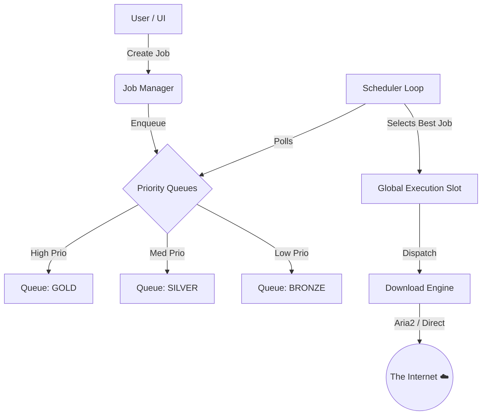
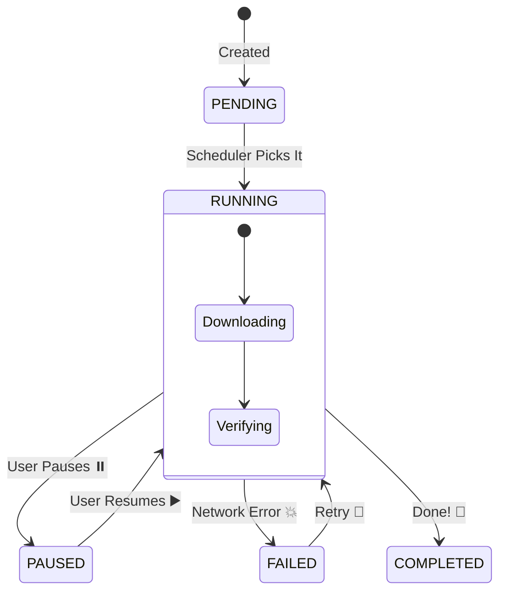

# 🚀 HermesLink

> **The Advanced, Multi-Queue, All-Seeing Download Manager of Your Dreams!** 🌌✨

Welcome to **HermesLink**, a robust and feature-rich download manager built to handle everything from direct downloads to media streams with style and precision. Whether you're juggling massive ISOs or managing a queue of cat videos, HermesLink has your back! 🐱💻

---

## 🌟 Key Features

- **🧠 Brainy Scheduler**: A smart, multi-queue system that respects your priorities.
- **🏎️ Multi-Engine Power**:
  - **Aria2**: For reliable, high-speed HTTP/FTP/Magnet downloads. 🌪️
  - **Direct**: Python-based streams for simple tasks. 💾
  - **Media**: Automatic media extraction (yt-dlp style). 📺
- **🚦 Traffic Control**:
  - **Strict Serialization**: One global active job to save bandwidth, but smart queuing to keep the pipeline full.
  - **State Machine**: Rock-solid job states (PENDING -> RUNNING -> PAUSED).
- **🛡️ Crash Proof**: Restarts right where it left off. Zombie jobs beware! 🧟‍♂️
- **📊 CLI Dashboard**: a Retro-cool terminal UI to monitor your bits and bytes.

---

## 🏗️ Architecture at a Glance

How does the magic happen? Here's a peek under the hood! 🧐

### The Core Loop



### State Machine Lifecycle



---

## 🚀 Getting Started

### 1️⃣ Installation

Ensure you have **Python 3.10+** and the requirements installed:

```bash
pip install -r requirements.txt
```

### 2️⃣ Run the Beast

Fire up the main system:

```bash
python src/main.py
```

### 3️⃣ Control Center

Open the dashboard to watch the magic interactively:

```bash
python src/dashboard.py
```

---

## 🎮 Controls (Dashboard)

|  Key  | Action   | Description                                  |
| :---: | :------- | :------------------------------------------- |
| **M** | `Menu`   | Switch between views and filters.            |
| **Q** | `Quit`   | Close the dashboard (Daemon keeps running!). |
| **P** | `Pause`  | Take a break! (Select Job First).            |
| **R** | `Resume` | Back to work!                                |

---

## 📂 Project Structure

```
📂 HermesLink
├── 📂 src
│   ├── 📂 core        # 🧠 The Brains (Manager, Scheduler)
│   ├── 📂 engines     # 🏎️ The Muscle (Aria2, Direct)
│   ├── 📂 dashboard   # 📺 The Face (UI)
│   └── 📜 main.py     # 🏁 Start Line
├── 📜 config.yaml     # ⚙️ Settings
└── 📜 README.md       # 📖 You are here!
```

---

## 🛠️ Roadmap

- [ ] **Web UI**: A shiny React/Next.js interface is coming soon! ⚛️
- [ ] **Plugin System**: Add your own download engines. 🧩
- [ ] **Cloud Sync**: Manage downloads from anywhere. ☁️

---

Made with ❤️ and ☕ by the HermesLink Team.
