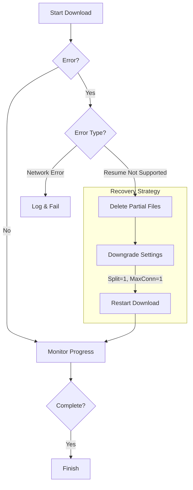
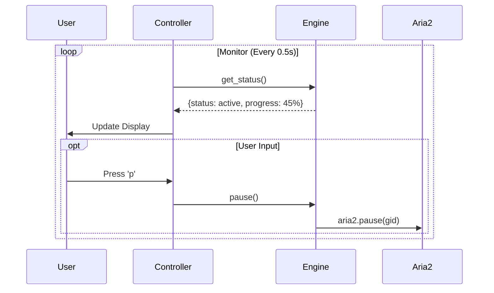

# Changes Detail

## 1. Project Info

- **Date**: 2026-01-18
- **Working Branch**: `aria2-routing`

## 2. Detailed Changes

### Added Functionality: Aria2Engine

We implemented a robust, error-aware download engine wrapping the `aria2c` daemon.

#### Core Features

- **Auto-Start Daemon**: Checks for `aria2c` via RPC ping; starts subprocess if missing.
- **Interactive Control**: Pause (`p`), Resume (`r`), Stop (`s`) supported in CLI.
- **Robustness**: Auto-downgrades to single-thread if server rejects multi-threading.
- **Cleanup**: Deletes partial files upon unrecoverable resume errors.

### Updated Flows

#### A. Error Recovery & Auto-Downgrade Logic

When a download fails to resume (e.g., "Invalid Range Header"), the system automatically performs a "clean restart" with safer settings.

#### B. Controller Interactive Loop

The controller now runs a non-blocking loop listening for user input while updating status.

## 3. Final Errors & Resolutions

### "Invalid Range Header" / "No URI Available"

- **Issue**: Some servers (e.g., Google Video links) rejected connections when `split=16` was used, or refused to resume an existing session, throwing "Invalid range header".
- **Resolution**: Implemented an **Error Classification** system. When `RESUME_NOT_SUPPORTED` is detected, the engine:
  1.  Deletes the local `.aria2` and media files (clearing the corrupted state).
  2.  Restarts the download with `split=1` (emulating a browser).
- **Fallback**: If even the single-thread restart fails, the controller prompts the user to force a full wipe and restart interactively.
