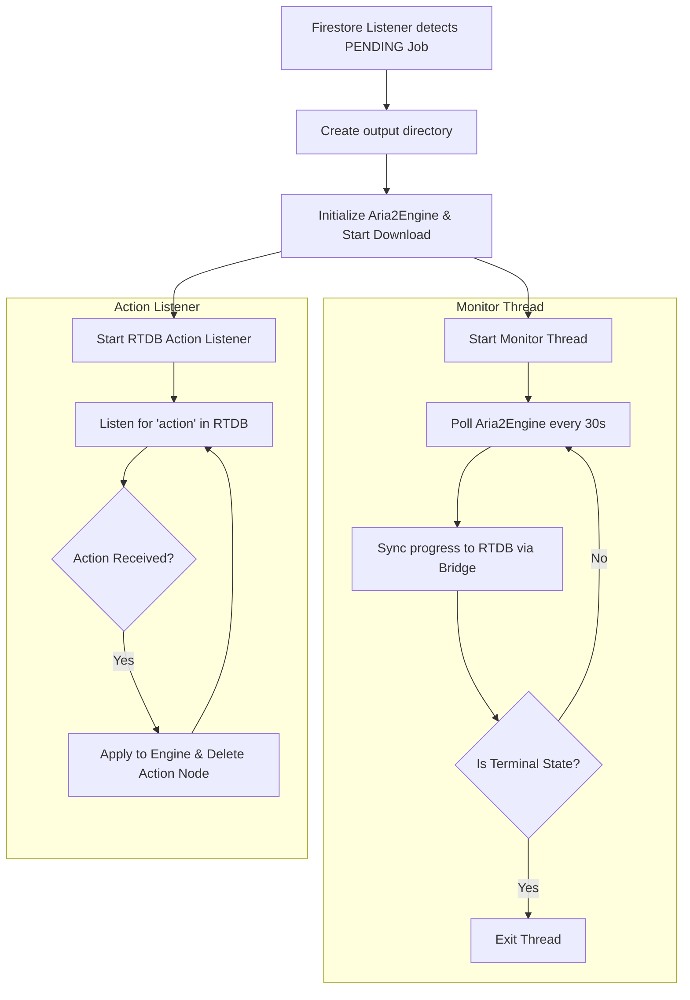

# Changes Detail

## 1. Project Info

- **Date**: 2026-03-21
- **Working Branch**: `main`

## 2. Detailed Changes

### Added Functionality: Agent-Engine Download Flow & RTDB Integration

We implemented a robust system where `test_agent.py` acts as an orchestrator, delegating downloads to `Aria2Engine` and syncing real-time state with Firebase RTDB.

#### Core Features

- **Aria2Engine Integration**: The agent no longer downloads files directly in Python. It hands jobs off to the `Aria2Engine` for optimal performance.
- **Firebase Dual-DB Strategy**: 
  - **RTDB**: Used for high-frequency, ephemeral data (download progress, immediate real-time commands like pause/resume, and active online presence).
  - **Firestore**: Used for durable, queryable state (identifying which jobs are PENDING, saving final COMPLETED/FAILED states).
- **FirebaseJobBridge**: Syncs low-latency download progress (%) and immediate state changes to Firebase RTDB for the frontend UI, while keeping Firestore updated for querying.
- **Real-Time Download Controls**: The agent listens to an `action` node in RTDB. When a user sends a `PAUSE`, `RESUME`, or `STOP` command from the web app, the agent immediately forwards it to the engine.
- **Agent Presence & Heartbeats**: The agent registers itself as `online` in Firebase RTDB (`presence/`) on startup and sends an update every 30 seconds to maintain its active status.
- **Job Isolation**: Downloads are organized strictly per device and per job (`~/Downloads/HermesLink_Test/<device_id>/jobs/<job_id>/`), preventing file collisions.
- **Graceful Shutdown**: The agent catches `Ctrl+C` to cleanly cancel active aria2 downloads, stop Firestore listeners, and mark its presence status as `offline` before exiting.

### Updated Flows

#### A. Centralized Job Processing & Monitoring

When a new `PENDING` job is detected in Firestore for the agent's `device_id`, the agent spawns a dedicated monitoring thread.

