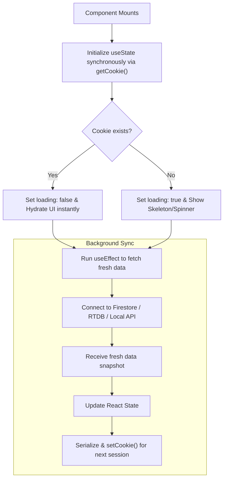

# Changes Detail

## 1. Project Info

- **Date**: 2026-03-22
- **Working Branch**: `main`

## 2. Detailed Changes

### Added Functionality: Multi-Device Download History Sync

We updated the download history synchronization to properly track and display jobs completed across all connected devices, rather than just the local server.

#### Core Features

- **Backend History Persistence**: Modified `test_agent.py` so that when a remote device finishes a download (or it fails or is stopped), the final `progress` state (including the exact filename and file size) from the Realtime Database (RTDB) is permanently saved to the Firestore `jobs` collection. 
- **Frontend History Migration**: Migrated `HistorySection.jsx` to fetch historical jobs (`COMPLETED`, `FAILED`, `STOPPED` states) directly from Firestore using the real-time `useJobs` hook instead of polling the local API server. This ensures all jobs from all devices are visible.
- **Device Identification**: Updated the Event Log UI to include a new **Device** column. It uses the `useDevices` hook to match each job's `device_id` to its human-readable `device_name` (e.g., displaying "MacBook Pro" instead of the raw device ID).

### Added Functionality: Frontend State Caching (Stale-While-Revalidate)

We implemented a robust local caching system on the frontend using browser cookies. This eliminates the initial loading delay when refreshing the website, instantly showing the data from the last session before syncing with Firebase and the backend.

#### Core Features

- **Cookie Management Utility**: Added `src/utils/cookieUtils.js` containing lightweight functions (`setCookie`, `getCookie`) to safely serialize and deserialize JSON objects into browser cookies. Size warnings are included to respect the 4KB limit per cookie.
- **Firebase Hook Caching**: Integrated cookie-based caching into the core real-time Firebase hooks:
  - `useJobs.js` (Firestore snapshots for job history/states): This hook accurately sync the download history (`COMPLETED`, `FAILED`, `STOPPED` states) from the Firestore `jobs` collection, retaining the unified query architecture.
  - `useDevices.js` (RTDB values for device online/offline presence)
  - `useJobProgress.js` (RTDB values for active job download progress)
- **API Fetch Caching**: Integrated the exact same caching mechanism into standard API-dependent components:
  - `QueueSection.jsx`: Caches the queue configurations fetched from `endpoints.queues.list()`.
  - `LandingSection.jsx`: Caches the global dashboard stats (`active`, `queue`, `history`) fetched asynchronously.

### Updated Flows

#### A. Initial Page Load & Refresh Cycle

When a user visits or refreshes the website, the following sequence occurs for the job list, device map, queues, and stats to prevent UI flashing:

