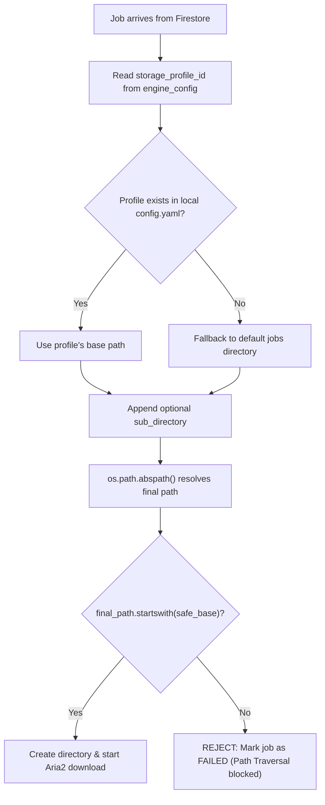

# Changes Detail

## 1. Project Info

- **Date**: 2026-03-26
- **Working Branch**: `main`

## 2. Detailed Changes

### Added Functionality: Dynamic Storage Profiles & Secure Download Routing

Previously, the download location for the Python Agent (`test_agent.py`) was hardcoded. This update introduces a "Storage Profiles" system where the device owner pre-configures allowed download directories, and users select them from the web UI when creating a download job.

#### Core Features

- **Local Storage Configuration (`config.yaml`)**: Created a `config.yaml` file at the backend root that allows the device owner to define named storage profiles with aliases and absolute paths (supporting `~` expansion). Example: `"Movies" -> "~/Videos/HermesLink_Movies"`.
- **Agent Profile Broadcasting**: Modified `test_agent.py` (`HermesAgent.__init__`) to load profiles from `config.yaml` on boot. These profiles are published to the Firebase RTDB `presence` node alongside the existing device info, making them discoverable by the frontend.
- **Secure Path Resolution with Traversal Protection**: Replaced the old hardcoded `output_path` logic in `_process_job()` with a dynamic resolver. It reads `storage_profile_id` and an optional `sub_directory` from the job's `engine_config`, resolves the final absolute path, and performs a critical `startswith()` check to block Path Traversal attacks (e.g., `../../etc`). Jobs that fail this check are immediately marked `FAILED`.
- **Frontend Device Hook Update (`useDevices.js`)**: Updated the `useDevices` hook to extract and expose the `storage_profiles` object from each device's RTDB presence data.
- **Frontend Job Modal Update (`NewJobModal.jsx`)**: 
    - Added a new **Storage Profile** dropdown that dynamically populates with the selected device's available storage locations (e.g., "Default Downloads", "Movies").
    - Renamed the old "Destination Folder" input to **Sub-directory (Optional)**, allowing users to specify a subfolder within the chosen profile (e.g., `Inception (2010)`).
    - Updated the Firestore `addDoc` payload to include `storage_profile_id` and `sub_directory` inside `engine_config`.

### Updated Flows

#### A. Download Path Resolution (Agent-Side)

When a new job arrives at the Python agent, the following secure resolution process occurs:

## 3. Files Changed

| File | Change Type | Summary |
|---|---|---|
| `backend/config.yaml` | **New** | Defines named storage profiles with aliases and paths |
| `backend/src/test_agent.py` | **Modified** | Loads profiles, publishes to RTDB, secure path resolution in `_process_job` |
| `frontend/.../hooks/useDevices.js` | **Modified** | Exposes `storage_profiles` from RTDB presence data |
| `frontend/.../features/NewJobModal.jsx` | **Modified** | Added Storage Profile dropdown, Sub-directory input, updated Firestore payload |
