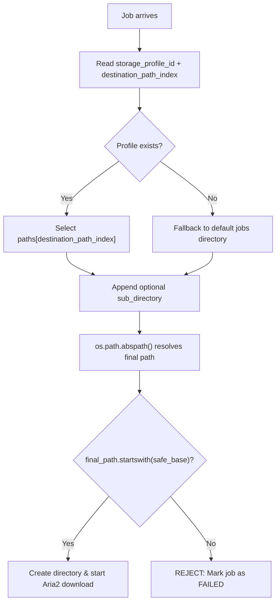

# Changes Detail

## 1. Project Info

- **Date**: 2026-03-28
- **Working Branch**: `main`

## 2. Detailed Changes

### Feature A: Multi-Destination Storage Profiles

Extended the existing single-path storage profile system to support **multiple download destinations per profile**.

#### Core Changes

- **YAML Schema Update (`config.yaml`)**: Replaced the singular `path` key with a `paths` list. Each profile can now declare multiple directories. Backward compatible — the agent auto-migrates old `path` → `paths: [path]`.
- **Agent Profile Loading (`test_agent.py`)**: Updated `HermesAgent.__init__` to iterate `paths` lists, expand `~` on each, and derive human-friendly `base_names` from the last folder segment (e.g. `~/Videos/Movies` → `"Movies"`). These enriched profiles are published to RTDB.
- **New Destination Selector (`NewJobModal.jsx`)**: Added a second **Destination** dropdown that appears when the selected profile has more than one path. Labels are derived from `base_names`. Sends `destination_path_index` alongside the existing `storage_profile_id` and `sub_directory` in the Firestore job payload.
- **Path Resolution Without `job_id` Subfolder**: Downloads now go directly to the resolved path (e.g. `~/Videos/Movies/Inception (2010)/`) instead of `~/Videos/Movies/Inception (2010)/<job_id>/`. Path traversal security check is preserved.

#### Download Path Resolution Flow



---

### Feature B: Firebase-Only Queue Configuration

Migrated queue configuration from local in-memory (`JobManager`) to **Firestore** as the single source of truth. Queues are now managed entirely from the dashboard.

#### Core Changes

- **New `useQueues.js` Hook**: Real-time Firestore hook using `onSnapshot` on the `queues` collection. Provides `{ queues, loading, createQueue, updateQueue, deleteQueue }`. Uses `updated_on` in DD-MM-YYYY format. Caches to cookies (same pattern as `useDevices.js`). Blocks deletion of the `"default"` queue.
- **Rewrote `QueueSection.jsx`**: Replaced the old local-API-based queue list with Firestore-powered CRUD. Added:
    - Create Queue modal (queue_id, name, max_parallel_jobs, max_threads_per_job, priority)
    - Edit Queue modal
    - Delete Queue (with confirmation, blocked for `"default"`)
    - Toggle Active/Paused status inline
    - Shows `updated_on` date on each card
- **Added Queue Modal CSS (`QueueSection.css`)**: New styles for modals, action buttons, error banner, and `updated_on` label matching the existing black/white design system.
- **Updated `NewJobModal.jsx`**: Replaced `endpoints.queues.list()` (local FastAPI call) with the `useQueues()` Firestore hook. Queue dropdown now shows queue `name` instead of raw `queue_id`.
- **Agent Reads Queue Config from Firestore (`test_agent.py`)**: When processing a job, the agent reads the queue document from Firestore to get `max_threads_per_job` and `max_parallel_jobs`. Falls back to defaults if the queue document doesn't exist.
- **Removed `/api/queues` Endpoint (`api_server.py`)**: Deleted `QueueConfigModel`, `QueueListResponse`, and the `GET /api/queues` route. Updated module docstring to reflect that queues are managed via Firestore.

#### Design Principle

| Data | Location | Reason |
|------|----------|--------|
| Storage profiles & paths | **Local YAML** | Device-specific (paths differ per machine) |
| Queue configuration | **Firestore** | User-level (shared across devices, managed from dashboard) |

#### Firestore Queue Schema (`queues/<queue_id>`)

```json
{
  "name": "Default",
  "max_parallel_jobs": 2,
  "max_threads_per_job": 4,
  "priority": 10,
  "enabled": true,
  "updated_on": "28-03-2026"
}
```

## 3. Files Changed

| File | Change Type | Summary |
|---|---|---|
| `backend/config.yaml` | **Modified** | `path` → `paths` list for multi-destination support |
| `backend/src/test_agent.py` | **Modified** | Multi-path loading with `base_names`, `destination_path_index` resolution, no `job_id` subfolder, Firestore queue config read |
| `backend/src/api_server.py` | **Modified** | Removed `/api/queues` endpoint and queue Pydantic models |
| `frontend/.../hooks/useQueues.js` | **New** | Firestore real-time hook for queue CRUD |
| `frontend/.../features/NewJobModal.jsx` | **Modified** | Second destination dropdown, `useQueues()` replaces local API, queue name in dropdown |
| `frontend/.../sections/QueueSection.jsx` | **Modified** | Firestore-powered queue management with create/edit/delete modals |
| `frontend/.../sections/QueueSection.css` | **Modified** | Added modal, button, and action styles |
