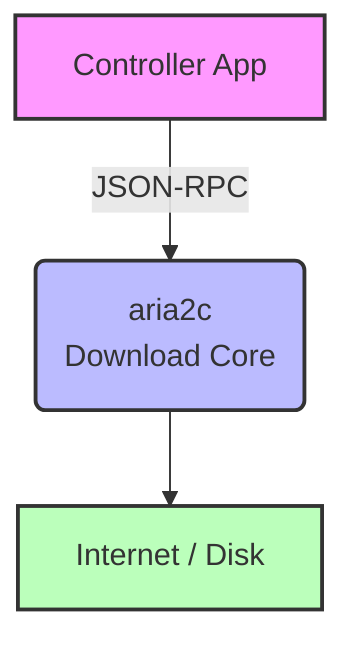
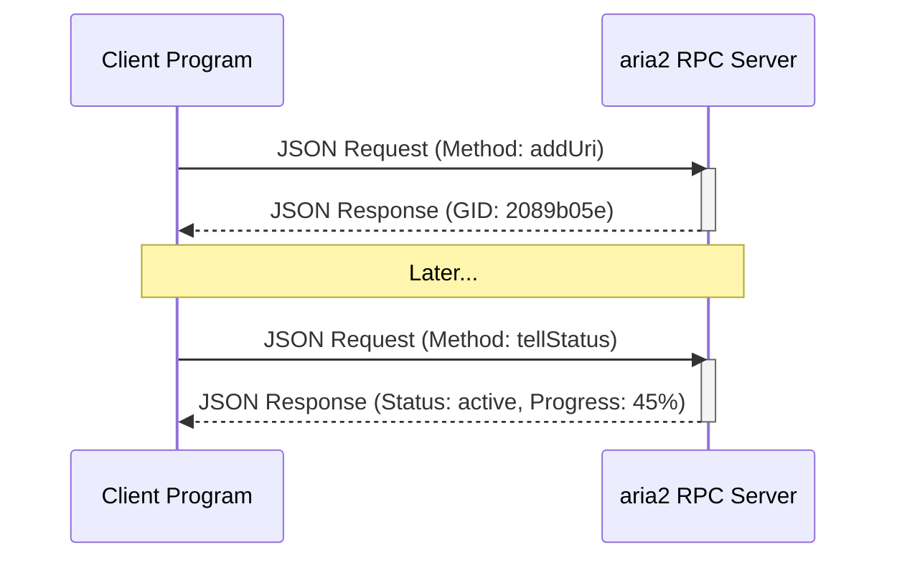
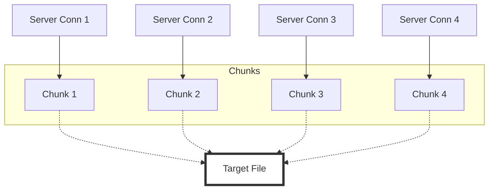
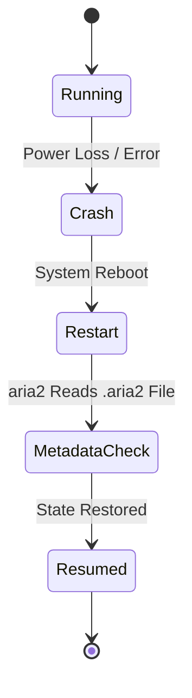
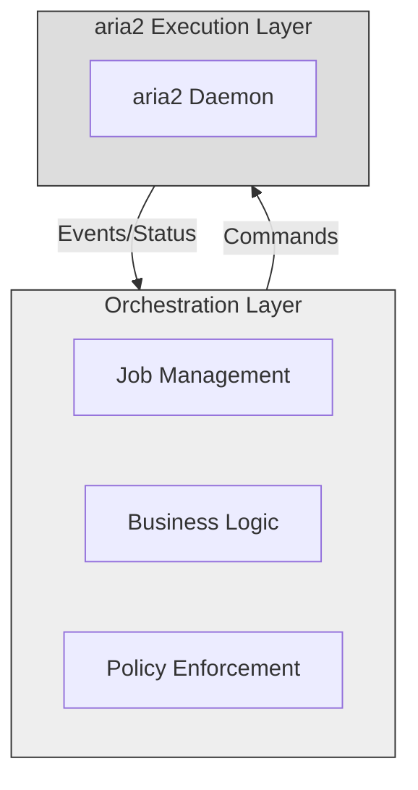

# ⚙️ aria2 as a Programmatic Download Engine

### 📊 A Research-Oriented Study for Automated Download Orchestration

---

## 🧠 Abstract

Modern download managers such as Internet Download Manager (IDM) provide high-speed downloads using techniques like multi-threading and resume support. However, these tools are primarily designed for **human interaction via graphical interfaces**, making them unsuitable for programmatic control and automation.

This document explores **aria2**, a headless and automation-focused download utility, as a foundational engine for building a **locally controlled, script-driven download orchestration system**. The study focuses on understanding what aria2 is, how it operates internally, and why it is architecturally suitable for automation-first systems.

---

## 📌 1. What is aria2?

aria2 is an **open-source, command-line download utility** designed for efficiency, reliability, and automation.

🔹 **Key characteristics:**

- No graphical interface
- Operates as a background service
- Supports multiple protocols
- Fully controllable via remote commands

🔹 **Supported protocols:**

- HTTP / HTTPS
- FTP / SFTP
- BitTorrent
- Metalink

aria2 is widely used in:

- Servers 🖥️
- Seedboxes 🌱
- Automated pipelines 🔄
- Headless environments 🚫🖱️

---

## 🧭 2. Design Philosophy of aria2

aria2 follows a **daemon-based architecture**, meaning it runs independently of the programs that control it.

### 🔁 Conceptual Process Model



This separation ensures:

- Crash isolation 💥
- Language independence 🌍
- Persistent state 💾

---

## 📦 3. Why aria2 is Not Imported as a Library

aria2 is **not a programming library**. It is an **external service**.

Instead of:

```python
import aria2  # ❌ This does not exist
```

Programs:

1. Send HTTP requests
2. Receive JSON responses
3. Control aria2 remotely

🧠 **This design is similar to how applications interact with:**

- Databases
- Web servers
- Torrent daemons

---

## 🔌 4. JSON-RPC: aria2’s Control Interface

aria2 exposes a JSON-RPC API, enabling remote control.

### 📡 RPC Communication Flow



This enables:

- Starting downloads ▶️
- Pausing & resuming ⏸️▶️
- Querying progress 📊
- Handling failures ❌

All responses are machine-readable, making automation reliable.

---

## 🚀 5. Multi-Threaded Downloads (IDM-Level Performance)

aria2 accelerates downloads using parallel HTTP range requests.

### 🧩 Conceptual Chunking Model



Benefits:

- Higher throughput 📈
- Better bandwidth utilization 🌐
- Configurable connection policies ⚙️

Unlike GUI tools, these parameters are explicit and controllable.

---

## ♻️ 6. Resume & Crash Recovery

aria2 persistently stores:

- Partial file data
- Download metadata

### 🔄 Recovery Flow



This ensures:

- No data loss
- Minimal re-download
- Robust long-running operations

---

## 🆔 7. Download Identity & Internal State

aria2 assigns each download a Global Identifier (GID).

📌 **Properties of GID:**

- Unique per download
- Used for all control operations
- Internal to aria2

Higher-level systems may map:

> **System Job ID** → **aria2 GID**

This abstraction prevents tight coupling and improves portability.

---

## 🆚 8. Comparison with GUI Download Managers (IDM)

| Feature                  |  IDM   |    aria2    |
| :----------------------- | :----: | :---------: |
| **Interface**            | GUI 🖱️ | Headless ⚙️ |
| **Automation**           |   ❌   |     ✅      |
| **Multi-threading**      |   ✅   |     ✅      |
| **Resume after crash**   |   ✅   |     ✅      |
| **Programmatic control** |   ❌   |     ✅      |
| **Server suitability**   |   ❌   |     ✅      |

📌 **Conclusion:**

- IDM is optimized for **users**.
- aria2 is optimized for **systems**.

---

## 🧩 9. aria2 as an Engine, Not a Manager

aria2 intentionally **avoids**:

- Job scheduling
- Permission handling
- User intent interpretation

It focuses **solely** on:

- Download execution
- Performance
- Reliability

### 🧱 Layered Responsibility Model



This separation improves maintainability and extensibility.

---

## ⚠️ 10. Failure Modes & Resilience

aria2 is resilient to:

- Network drops 🌐❌
- Partial downloads 🧩
- Process termination 💥

However, it **does not**:

- Decide job semantics
- Manage queues logically
- Handle permissions

These concerns belong to the orchestration system above it.

---

## 🧾 11. Conclusion

aria2 represents a fundamentally different philosophy from GUI-based download managers. By exposing a remote control interface and persisting state independently, it enables the construction of robust, automation-first download systems.

For projects requiring:

- Scripted control 🧠
- Reliability 🛡️
- Extensibility 🔧
- Future remote interfaces 🌍

**aria2 serves as a powerful and scalable foundation.**

---

## 🔮 12. Future Scope

With aria2 as a base engine, systems can evolve to include:

- Remote interfaces 📱
- Scheduling & prioritization ⏱️
- Multi-user orchestration 👥
- Web or messaging frontends 🌐

All without altering aria2’s core role.
